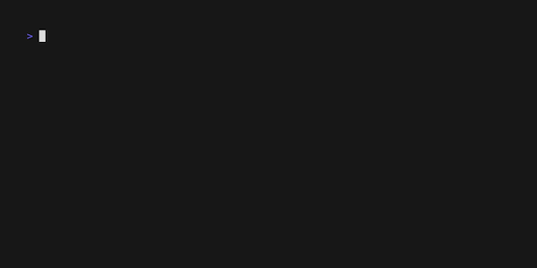

# bubbles

bubbles is a collection of TUI elements for [Bubble Tea](https://github.com/charmbracelet/bubbletea) applications.

## Tabs

`tabs` is a remix on the [Bubble Tea tabs example](https://github.com/charmbracelet/bubbletea/tree/main/examples/tabs).
It abstracts away the tab logic into a separate model and provides management of tab-content.

* [Example code, basic tabs](examples/tabs/simple/main.go)
* [Example code, wraparound tabs](examples/tabs/wraparound/main.go)
* [Example code, resizeable tabs](examples/tabs/resizeable/main.go)

## License

This project is licensed under the terms of the MIT license.
